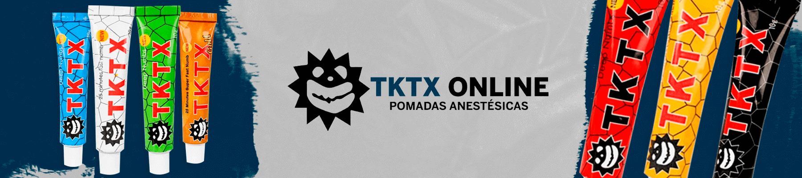
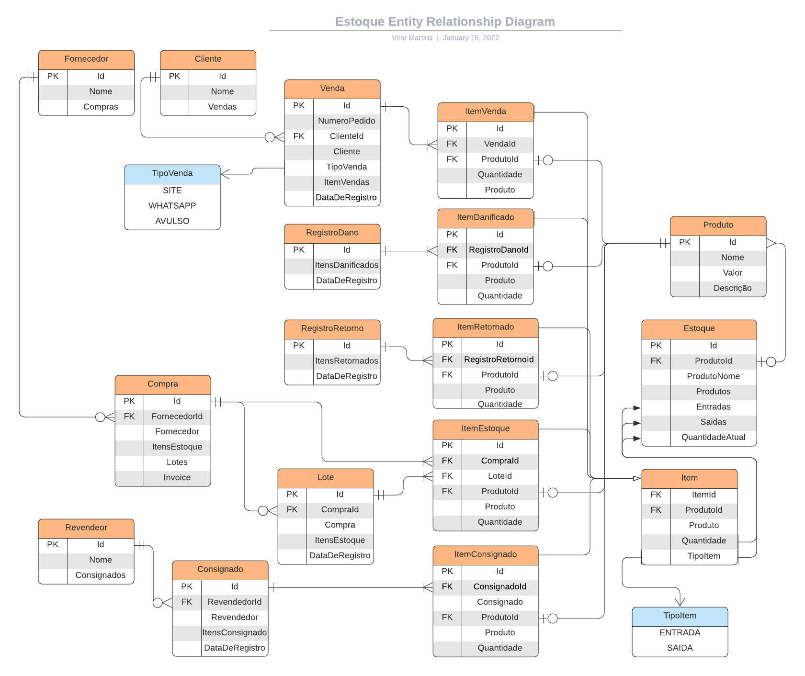

# Sistema de Gerenciamento de Estoque, Fornecedores e Revendedores

- <a href="https://tktxonline.com.br/">TKTX Online</a> 

- <a href="https://galeriadapele.com.br/">Galeria da Pele</a> 

- <a href="https://tabacariadaquebrada.com.br/">Tabacaria da Quebrada</a> 

## Estoque e Lote

O estoque é dividido em lotes que tem uma data de inicio quando são criados referente a chegada dos produtos na loja. O lote também armazena a quantidade de cada produto que chegou.

O estoque armazena o total dos lotes e quando a quantidade de produtos referente a um lote é vendida o Lote entra em mode de fechamento, abrindo uma solicitação de aprovação ao administrador do sistema.

Organizar em lotes ajuda a ter um controle da duração dos produtos e controle de entrada e saida.

## Entradas no estoque

- Compras => De Fornecedores ou da fabrica
- Vendas => Que Retornaram (Devoluções, CEP Inexistene, Destinatário não Encontrado)

## Saidas do estoque

- Vendas => Para Clientes do Site
- Vendas => Para Clientes do WP
- Vendas => Para Clientes Avulsos
- Vendas => Para Revendedores
- Consignado => Para Revendedores (Status: Pendente, Pago, Quantidade Pendente e Quantidade Paga em quantidade de produtos.
- Danificados => Produtos danificados no estoque ou durante o transporte ou que passaram da validade
 
## Compras

Compras servem para ter uma estimativa de tempo desde o pedido de compra com o fornecedor e a chegada a loja. Uma compra também estará associada a diversos lotes, para ter o dado de divergência dos produtos perdidos ou danificados durante o transporte.

Compra tem uma relação de um para muitos com Lote, pois uma compra pode ter varios lotes e um lote só pode ter uma compra.
 
## Usuarios

- Administrador (Acesso de criação de compras, aprovamento de baixa de lotes, criação de avisos de nivel estoque)
- Funcionario (Entradas e baixas no estoque)
- Revendedor (Solicitação de Venda ou Consignado)

## Entity Relationship

- Venda
- ItemVenda
- Produto
- Cliente
- Revendedor
- Consignado
- ItemConsignado
- Danificado
- ItemDanificado
- Compra
- ItemCompra
- Fornecedor
- Estoque
- Lote
  
## Features
  
- Cadastro de produto
- Cadastro de fornecedores
- Cadastro de Clientes
- Cadastro de Distribuidor
- Controle de pagamento ao entregador
- Controle de Estoque
- Aviso de Estoque baixo
- Baixa automatica de estoque
- Estoque Mínimo
- Acesso ao estoque via WEB
- Acesso ao estoque via MOBILE (PWA)
- Acesso a nivel de usuario
- Sistema de saida de produto e forma de pagamento
- Controle de contas Pagar/Receber
- Aviso de vencimento de Contas
- Relatórios diversos
- O sistema podera cadastrar e gerenciar multiplas empresas
