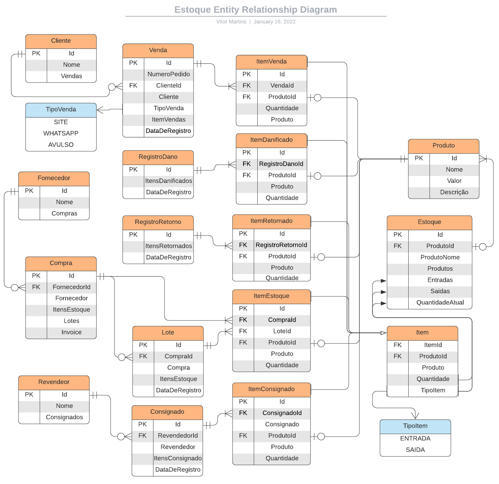

# Sistema de Gerenciamento de Estoque, Fornecedores e Revendedores

## Dependências

- Framework .NET 6.0
- AutoMapper.Extensions.Microsoft.DependencyInjection 11.0.0
- FluentResults 3.3.0
- Microsoft.EntityFrameworkCore 6.0.3
- Microsoft.EntityFrameworkCore.Proxies 6.0.3
- Microsoft.EntityFrameworkCore.SqlServer 6.0.3
- Microsoft.EntityFrameworkCore.Tools 6.0.3
- Microsoft.VisualStudio.Web.CodeGeneration.Design 6.0.2
- Swashbuckle.AspNetCore 6.3.0

## Estoque e Lote

O estoque é dividido em lotes que tem uma data de inicio quando são criados referente a chegada dos produtos na loja. O lote também armazena a quantidade de cada produto que chegou.

O estoque armazena o total dos lotes e quando a quantidade de produtos referente a um lote é vendida o Lote entra em mode de fechamento, abrindo uma solicitação de aprovação ao administrador do sistema.

Organizar em lotes ajuda a ter um controle da duração dos produtos e controle de entrada e saida.

## Entradas no estoque

- Compras => De Fornecedores ou da fabrica
- Vendas => Que Retornaram (Devoluções, CEP Inexistene, Destinatário não Encontrado)

## Saidas do estoque

- Vendas => Para Clientes do Site
- Vendas => Para Clientes do WP
- Vendas => Para Clientes Avulsos
- Vendas => Para Revendedores
- Consignado => Para Revendedores (Status: Pendente, Pago, Quantidade Pendente e Quantidade Paga em quantidade de produtos.
- Danificados => Produtos danificados no estoque ou durante o transporte ou que passaram da validade

## Compras

Compras servem para ter uma estimativa de tempo desde o pedido de compra com o fornecedor e a chegada a loja. Uma compra também estará associada a diversos lotes, para ter o dado de divergência dos produtos perdidos ou danificados durante o transporte.

Compra tem uma relação de um para muitos com Lote, pois uma compra pode ter varios lotes e um lote só pode ter uma compra.

## Usuarios

- Administrador (Acesso de criação de compras, aprovamento de baixa de lotes, criação de avisos de nivel estoque)
- Funcionario (Entradas e baixas no estoque)
- Revendedor (Solicitação de Venda ou Consignado)

## Entity Relationship

